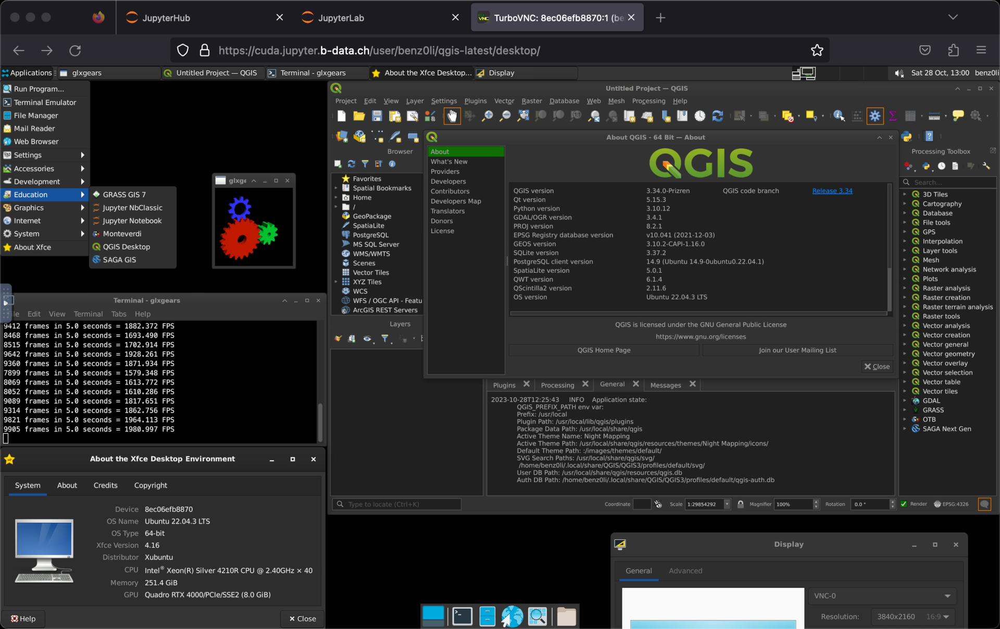

# CUDA-enabled JupyterLab QGIS docker stack

GPU accelerated, multi-arch (`linux/amd64`, `linux/arm64/v8`) docker images:

* [`glcr.b-data.ch/jupyterlab/cuda/qgis/base`](https://gitlab.b-data.ch/jupyterlab/cuda/qgis/base/container_registry)

Images available for QGIS versions ≥ 3.34.0.



**Features**

The same as the
[JupyterLab QGIS docker stack](README.md#jupyterlab-qgis-docker-stack) plus

* VirtualGL: Enables OpenGL applications to run with full GPU acceleration.
* CUDA runtime,
  [CUDA math libraries](https://developer.nvidia.com/gpu-accelerated-libraries),
  [NCCL](https://developer.nvidia.com/nccl) and
  [cuDNN](https://developer.nvidia.com/cudnn)

:point_right: See the [CUDA Version Matrix](CUDA_VERSION_MATRIX.md) for detailed
information.

**Subtags**

The same as the
[JupyterLab QGIS docker stack](README.md#jupyterlab-qgis-docker-stack).

## Table of Contents

* [Prerequisites](#prerequisites)
* [Install](#install)
* [Usage](#usage)
* [Similar projects](#similar-projects)

## Prerequisites

The same as the
[JupyterLab QGIS docker stack](README.md#prerequisites) plus

* NVIDIA GPU
* NVIDIA Linux driver
* NVIDIA Container Toolkit

:information_source: The host running the GPU accelerated images only requires
the NVIDIA driver, the CUDA toolkit does not have to be installed.

## Install

To install the NVIDIA Container Toolkit, follow the instructions for your
platform:

* [Installation Guide &mdash; NVIDIA Cloud Native Technologies documentation](https://docs.nvidia.com/datacenter/cloud-native/container-toolkit/install-guide.html#supported-platforms)

## Usage

### Build image (base)

*latest*:

```bash
cd base && docker build \
  --build-arg BASE_IMAGE=ubuntu \
  --build-arg BASE_IMAGE_TAG=22.04 \
  --build-arg CUDA_IMAGE=nvidia/cuda \
  --build-arg CUDA_IMAGE_SUBTAG=cudnn8-runtime-ubuntu22.04 \
  --build-arg CUDA_VERSION=11.8.0 \
  --build-arg QGIS_VERSION=3.36.0 \
  --build-arg OTB_VERSION=9.0.0 \
  --build-arg PYTHON_VERSION=3.11.8 \
  --build-arg GIT_VERSION=2.43.2 \
  -t jupyterlab/cuda/qgis/base \
  -f Dockerfile .
```

*ltr/version*:

```bash
cd base && docker build \
  --build-arg BASE_IMAGE=ubuntu \
  --build-arg BASE_IMAGE_TAG=22.04 \
  --build-arg CUDA_IMAGE=nvidia/cuda \
  --build-arg CUDA_IMAGE_SUBTAG=cudnn8-runtime-ubuntu22.04 \
  --build-arg CUDA_VERSION=11.8.0 \
  --build-arg QGIS_VERSION=3.34.4 \
  --build-arg OTB_VERSION=8.1.2 \
  --build-arg PYTHON_VERSION=3.11.8 \
  --build-arg GIT_VERSION=2.43.2 \
  -t jupyterlab/cuda/qgis/base:ltr \
  -f Dockerfile .
```

### Create home directory

Create an empty directory using docker:

```bash
docker run --rm \
  -v "${PWD}/jupyterlab-jovyan":/dummy \
  alpine chown 1000:100 /dummy
```

It will be *bind mounted* as the JupyterLab user's home directory and
automatically populated.  
:exclamation: *Bind mounting* a subfolder of the home directory is only possible
for images with QGIS version ≥ 3.34.4.

### Run container

self built:

```bash
docker run -it --rm \
  --gpus 'device=all' \
  -p 8888:8888 \
  -u root \
  -v "${PWD}/jupyterlab-jovyan":/home/jovyan \
  -e NB_UID=$(id -u) \
  -e NB_GID=$(id -g) \
  -e CHOWN_HOME=yes \
  -e CHOWN_HOME_OPTS='-R' \
  jupyterlab/cuda/qgis/base{:ltr,:MAJOR.MINOR.PATCH}
```

from the project's GitLab Container Registries:

```bash
docker run -it --rm \
  --gpus 'device=all' \
  -p 8888:8888 \
  -u root \
  -v "${PWD}/jupyterlab-jovyan":/home/jovyan \
  -e NB_UID=$(id -u) \
  -e NB_GID=$(id -g) \
  -e CHOWN_HOME=yes \
  -e CHOWN_HOME_OPTS='-R' \
  IMAGE{:ltr,:MAJOR[.MINOR[.PATCH]]}
```

`IMAGE` being one of

* [`glcr.b-data.ch/jupyterlab/cuda/qgis/base`](https://gitlab.b-data.ch/jupyterlab/cuda/qgis/base/container_registry)

The use of the `-v` flag in the command mounts the empty directory on the host
(`${PWD}/jupyterlab-jovyan` in the command) as `/home/jovyan` in the container.

`-e NB_UID=$(id -u) -e NB_GID=$(id -g)` instructs the startup script to switch
the user ID and the primary group ID of `${NB_USER}` to the user and group ID of
the one executing the command.

`-e CHOWN_HOME=yes -e CHOWN_HOME_OPTS='-R'` instructs the startup script to
recursively change the `${NB_USER}` home directory owner and group to the
current value of `${NB_UID}` and `${NB_GID}`.  
:information_source: This is only required for the first run.

The server logs appear in the terminal.

#### Using Podman (rootless mode, 3.34.0+)

Create an empty home directory:

```bash
mkdir "${PWD}/jupyterlab-root"
```

Use the following command to run the container as `root`:

```bash
podman run -it --rm \
  --device 'nvidia.com/gpu=all' \
  -p 8888:8888 \
  -u root \
  -v "${PWD}/jupyterlab-root":/home/root \
  -e NB_USER=root \
  -e NB_UID=0 \
  -e NB_GID=0 \
  -e NOTEBOOK_ARGS="--allow-root" \
  IMAGE{:ltr,:MAJOR[.MINOR[.PATCH]]}
```

#### Using Docker Desktop

[Creating a home directory](#create-home-directory) *might* not be required.
Also

```bash
docker run -it --rm \
  --gpus 'device=all' \
  -p 8888:8888 \
  -v "${PWD}/jupyterlab-jovyan":/home/jovyan \
  IMAGE{:ltr,:MAJOR[.MINOR[.PATCH]]}
```

*might* be sufficient.

## Similar projects

None. I would like to mention

* [selkies-project/docker-nvidia-egl-desktop](https://github.com/selkies-project/docker-nvidia-egl-desktop)

which also relies on VirtualGL (EGL backend) for direct access to the GPU.

**What makes this project unique:**

1. Multi-arch: `linux/amd64`, `linux/arm64/v8`  
   :information_source: No GPU acceleration on Apple M series.
1. Derived from [`nvidia/cuda:11.8.0-cudnn8-runtime-ubuntu22.04`](https://hub.docker.com/r/nvidia/cuda/tags?page=1&name=11.8.0-cudnn8-runtime-ubuntu22.04)
1. [VirtualGL](https://virtualgl.org): Fully GPU accelerated OpenGL applications
1. Just Python – no [Conda](https://github.com/conda/conda) /
   [Mamba](https://github.com/mamba-org/mamba)

See [Notes](NOTES.md) for tweaks, settings, etc.
