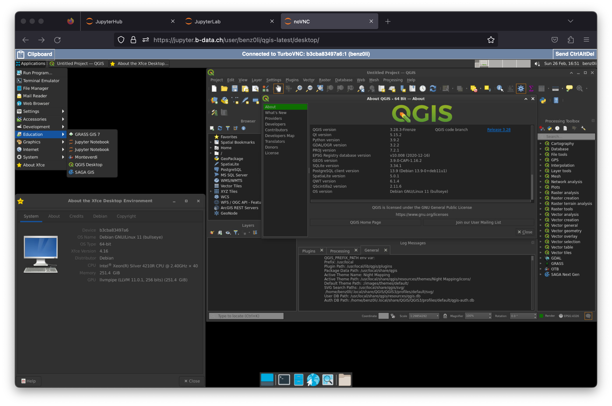

[](https://github.com/RichardLitt/standard-readme/blob/master/example-readmes/minimal-readme.md) [](https://www.repostatus.org/#active) <a href="https://liberapay.com/benz0li/donate"></a>

# JupyterLab QGIS docker stack

Multi-arch (`linux/amd64`, `linux/arm64/v8`) docker images:

* [`glcr.b-data.ch/jupyterlab/qgis/base`](https://gitlab.b-data.ch/jupyterlab/qgis/base/container_registry)



**Features**

* **JupyterLab**: A web-based interactive development environment for Jupyter
  notebooks, code, and data. The images include
  * **Git**: A distributed version-control system for tracking changes in source
    code.
  * **Python**: An interpreted, object-oriented, high-level programming language
    with dynamic semantics.
  * **TurboVNC**: A high-speed version of VNC derived from TightVNC.  
    :information_source: Tuned to maximize performance for image-intensive
    applications.
  * **Zsh**: A shell designed for interactive use, although it is also a
    powerful scripting language.
  * **Xfce (via noVNC + TurboVNC)**: A lightweight desktop environment for
    UNIX-like operating systems.
    * **GRASS GIS**: A free and open source Geographic Information System (GIS).
    * **Orfeo Toolbox**: An open-source project for state-of-the-art remote
      sensing.  
      :information_source: amd64 only
    * **QGIS**: A free, open source, cross platform (lin/win/mac) geographical
      information system (GIS).
    * **SAGA GIS**: A Geographic Information System (GIS) software with immense
      capabilities for geodata processing and analysis.

Images considered stable for QGIS versions ≥ 3.28.3 and ≥ 3.22.16 (LTR).

**Subtags**

* `{QGIS_VERSION,latest,ltr}-root`: Container runs as `root`

## Table of Contents

* [Prerequisites](#prerequisites)
* [Install](#install)
* [Usage](#usage)
* [Similar project](#similar-project)
* [Contributing](#contributing)
* [License](#license)

## Prerequisites

This projects requires an installation of docker.

## Install

To install docker, follow the instructions for your platform:

* [Install Docker Engine | Docker Documentation > Supported platforms](https://docs.docker.com/engine/install/#supported-platforms)
* [Post-installation steps for Linux](https://docs.docker.com/engine/install/linux-postinstall/)

## Usage

### Build image (base)

*latest*:

```bash
cd base && docker build \
  --build-arg QGIS_VERSION=3.30.1 \
  --build-arg PYTHON_VERSION=3.10.10 \
  --build-arg GIT_VERSION=2.40.0 \
  --build-arg OTB_VERSION=8.1.1 \
  -t jupyterlab/qgis/base \
  -f Dockerfile .
```

*ltr*:

```bash
cd base && docker build \
  --build-arg QGIS_VERSION=3.28.5 \
  --build-arg PYTHON_VERSION=3.10.10 \
  --build-arg GIT_VERSION=2.40.0 \
  --build-arg OTB_VERSION=8.1.1 \
  -t jupyterlab/qgis/base:ltr \
  -f Dockerfile .
```

*version*:

```bash
cd base && docker build \
  -t jupyterlab/qgis/base:MAJOR.MINOR.PATCH \
  -f MAJOR.MINOR.PATCH.Dockerfile .
```

For `MAJOR.MINOR.PATCH` ≥ `3.28.3` and `MAJOR.MINOR.PATCH` ≥ `3.22.16` (LTR versions).

### Create home directory

Create an empty directory:

```bash
mkdir jupyterlab-jovyan
sudo chown 1000:100 jupyterlab-jovyan
```

It will be *bind mounted* as the JupyterLab user's home directory and
automatically populated on first run.

### Run container

| :exclamation: Always mount the user's **entire** home directory.<br>Mounting a subfolder prevents the container from starting.[^1] |
|:-----------------------------------------------------------------------------------------------------------------------------------|

[^1]: The only exception is the use case described at [Jupyter Docker Stacks > Quick Start > Example 2](https://github.com/jupyter/docker-stacks#quick-start).

self built:

```bash
docker run -it --rm \
  -p 8888:8888 \
  -u root \
  -v "${PWD}/jupyterlab-jovyan":/home/jovyan \
  -e NB_UID=$(id -u) \
  -e NB_GID=$(id -g) \
  -e CHOWN_HOME=yes \
  -e CHOWN_HOME_OPTS='-R' \
  jupyterlab/qgis/base{:ltr,:MAJOR[.MINOR[.PATCH]]}
```

from the project's GitLab Container Registries:

  ```bash
  docker run -it --rm \
    -p 8888:8888 \
    -u root \
    -v "${PWD}/jupyterlab-jovyan":/home/jovyan \
    -e NB_UID=$(id -u) \
    -e NB_GID=$(id -g) \
    -e CHOWN_HOME=yes \
    -e CHOWN_HOME_OPTS='-R' \
    IMAGE{:ltr,:MAJOR[.MINOR[.PATCH]]}
  ```

`IMAGE` being one of

* [`glcr.b-data.ch/jupyterlab/qgis/base`](https://gitlab.b-data.ch/jupyterlab/qgis/base/container_registry)

The use of the `-v` flag in the command mounts the empty directory on the host
(`${PWD}/jupyterlab-jovyan` in the command) as `/home/jovyan` in the container.

`-e NB_UID=$(id -u) -e NB_GID=$(id -g)` instructs the startup script to switch
the user ID and the primary group ID of `${NB_USER}` to the user and group ID of
the one executing the command.

`-e CHOWN_HOME=yes -e CHOWN_HOME_OPTS='-R'` instructs the startup script to
recursively change the `${NB_USER}` home directory owner and group to the
current value of `${NB_UID}` and `${NB_GID}`.  
:information_source: This is only required for the first run.

The server logs appear in the terminal.

**Using Docker Desktop**

`sudo chown 1000:100 jupyterlab-jovyan` *might* not be required. Also

```bash
docker run -it --rm \
  -p 8888:8888 \
  -v "${PWD}/jupyterlab-jovyan":/home/jovyan \
  IMAGE{:ltr,:MAJOR[.MINOR[.PATCH]]}
```

*might* be sufficient.

## Similar project

* [pangeo-data/jupyter-earth](https://github.com/pangeo-data/jupyter-earth)

What makes this project different:

1. Multi-arch: `linux/amd64`, `linux/arm64/v8`
1. Base image: [Debian](https://hub.docker.com/_/debian) instead of
   [Ubuntu](https://hub.docker.com/_/ubuntu)
1. Just Python – no [Conda](https://github.com/conda/conda) /
   [Mamba](https://github.com/mamba-org/mamba)

See [Notes](NOTES.md) for tweaks, settings, etc.

## Contributing

PRs accepted.

This project follows the
[Contributor Covenant](https://www.contributor-covenant.org)
[Code of Conduct](CODE_OF_CONDUCT.md).

## License

[MIT](LICENSE) © 2023 b-data GmbH
